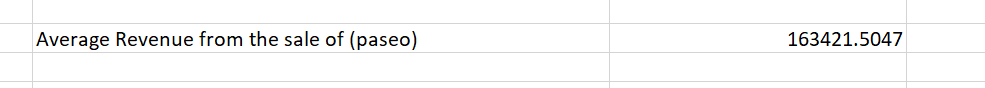
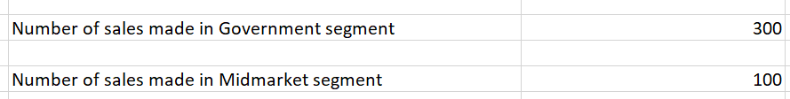
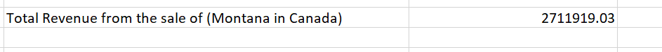
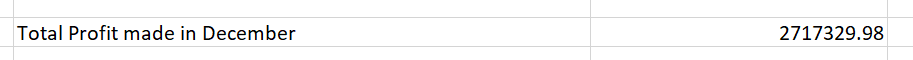

# Sales-Data-Analysis
## Introduction
---
This is a sales analysis of an imaginery store
The project is to analyze and gain insight into the sales performance of this store and help stakeholders make inform sales and product decisions.

**_DISCLAIMER**_:_ All data set and reports do not represent any store, country, personnel.

## The average revenue generated from each sale of ‘paseo’
---

One argument exist in the above problem
(total revenue(Sales, for product ‘paseo’))

Using the =AverageIf function,
An average of 163421.5047 sales was generated from the sales of paseo

# The number of sales made in the government segment and midmarket segment.
----

---

This refers to a number of sales within the government and midmarket segment

The countIf function was applied and a total of 300 sales was recorded in the government segment and 100 sales for the midmarket segment

# Total revenue generated for the sales of ‘montana in ‘canada’
-----

Using the SumIf function.

Selected the Sum range and country argument, followed by the product argument.

The total revenue generated for the sales of montana in Canada is 2711919.03

# In which country, segment and month was the highest unit of goods sold.
---

To resolve the above problem
1.	Find the highest unit of goods sold using the Max function from the Unit of goods sold Column
2.	For the country, segment, and month in which the highest sales occurred, used the VLOOKUP function to access where the highest sales generated took place
-----

The highest unit of sales is 4493 and this took place in the united states of America, under the government segment in the month of July, in the year 2014, I had to further extend the assessment to the years to have a clearer insight into the data.

# What is the total profit made in December 
--
Using the SumIf function 

The total profit made in the month of December is 2717329.98
